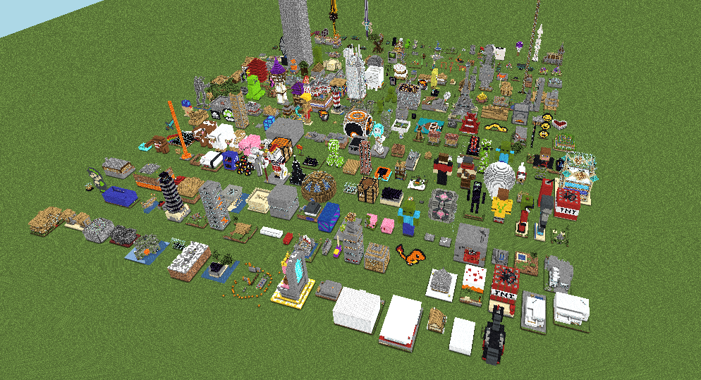

# minecraft-schematics-dataset
Minecraft schematics dataset

[](https://rom1504.github.io/minecraft-schematics-dataset)


## Download
bash download.sh

## Python reader

Check on [colab](https://colab.research.google.com/github/rom1504/minecraft-schematics-dataset/blob/main/pyReader/schematics.ipynb)

## Js reader

```
cd jsReader
npm install
node example.js 
```
